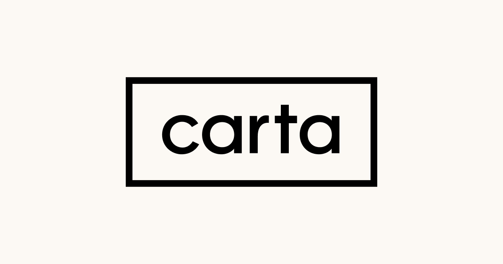
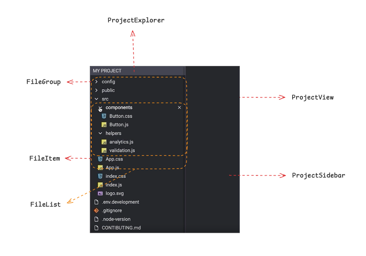
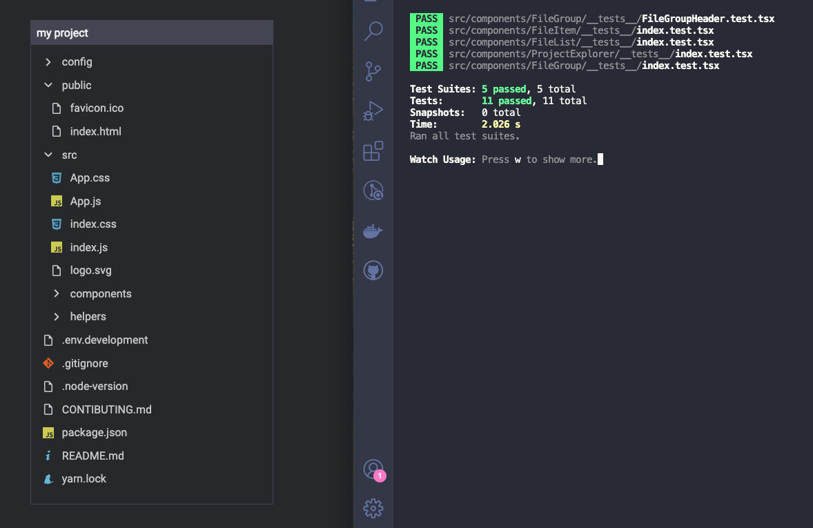

# Carta File Explorer Take-home
The goal of this project is to replicate the Visual Studio Code Explorer UI with key functionalities using React and TypeScript. The solution is designed to be clean, testable and extendable.

<div align="center">
	
</div>

## Quick start

```sh
# Install NPM dependencies
yarn
# Run the app
yarn start
# Run the tests
yarn test
# Zip solution
tar -czvf [your initials]-CARTA.tar.gz --exclude="node_modules" .
```

## Installing Node, NPM, and Yarn

Install Node and NPM

- Mac
  - Install [Homebrew](https://docs.brew.sh/Installation)
  - Run `brew install node`
- Windows
  - Download and run the [Node Windows installer](https://nodejs.org/en/download/)
- Linux
  - See instructions for your distribution's package manager

Install Yarn

- Run `npm install -g yarn`

## Development 
### Concept
The goal is to create an application similar to the VS Code Explorer, where users can view a list of items and groups (containing collapsible items). Both individual items and groups can be deleted. This project follows clean code practices and includes unit and integration tests to ensure functionality and maintainability.


### Hands on
To begin, I took a screenshot of the final result and sketch over it which components would exist.

<div align="center">
	
</div>

Note: This sketch was created using [excalidraw](https://excalidraw.com/).

- FileItem -> A basic file card displaying the file name. It has a delete option (an "X" button) that appears on hover.
- FileGroup -> Contains a card and a collapsible area. The card that shows a folder name and includes a delete option (an "X" button) that appears on hover as well. The collapsable area is a FileList.
- FileList -> Renders an array of files as either FileItem or FileGroup based on the file type. It is used in both ProjectExplorer and within the collapsible area of FileGroup.
- ProjectExplorer -> A table component that displays the project name and a FileList.
- ProjectSide -> In a real application, this would show the content of the selected file, but given the fact this falls outside of this project's scope, this component was not implemented.
- ProjectView -> The main component that includes ProjectExplorer and ProjectSide.

##  Decisions
- TypeScript ->  I decided to use TypeScript since Carta uses it as well. This allows the project to closely resemble real-life scenarios.
- Custom hooks -> I used custom hooks to encapsulate and reuse stateful logic across components (like api data, loading and error handling). (useFetch.ts)
- Context -> This project uses the ContextAPI, that wraps the whole custom hook logic and exposes it globally. (DataProvider.tsx)
- SOLID Principles -> This project uses the O from SOLID (Open-closed principle), which means the code must be open  for extension and close for modification. (iconUtils.tsx)
- Dependency Injection -> Used in many different ways: Break bigger components into small reusable ones (FileGroup), reusing logic through custom hooks (useFetch.ts) and injecting it globally through the context api (DataProvider.tsx)
- Unit and Integration tests -> I implemented tests also for the project to closely resemble real-life scenarios. Now it's possible to confirm component functionality and interactions, enhances code quality, allow confident updates, and serves as documentation for future developers. (all the files inside __tests__)

<div align="center">
	
</div>